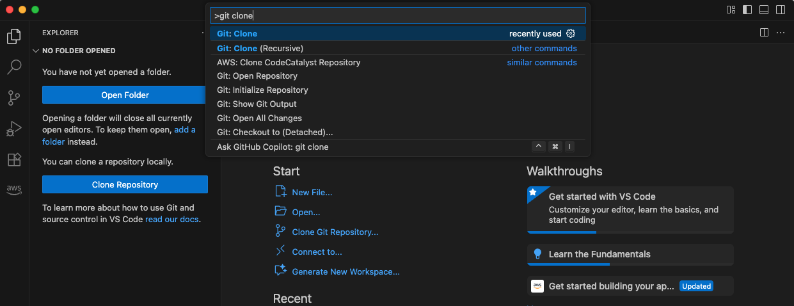
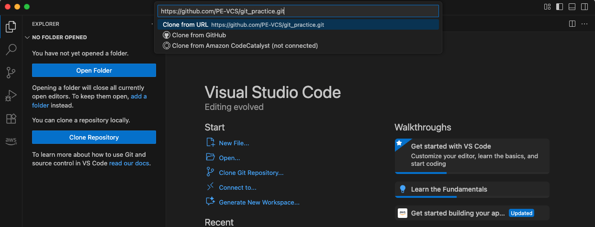
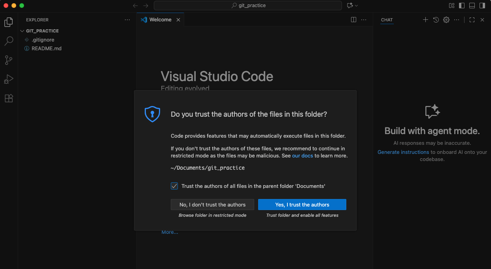
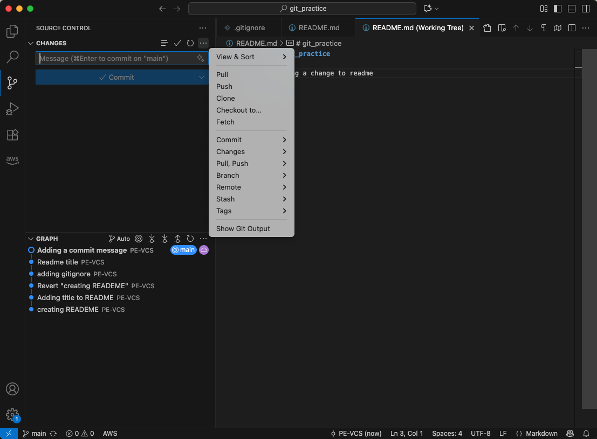

# Git Integration with Visual Studio Code

Up until now, you've been using Git through the command line in Git Bash. While the command line is powerful and essential to understand, most developers use a code editor or IDE (Integrated Development Environment) that has Git integration built in. Visual Studio Code (VS Code) is one of the most popular editors and has excellent Git support built right in.

In this lab, you'll learn how to use VS Code's Git features to clone repositories, make changes, commit, push, pull, and resolve conflicts—all without leaving your editor. This workflow is what most professional developers use daily.

### Estimated Time: 40 Minutes

**Prerequisites:** 
- Complete Labs 1.1 through 1.4
- Have Visual Studio Code installed (free download from https://code.visualstudio.com)
- Have your GitHub account credentials ready

## Part 1: Introduction to Visual Studio Code

Visual Studio Code (VS Code) is a free, open-source code editor developed by Microsoft. It's lightweight, fast, and has become the most popular code editor for developers.

**Key Features:**
- Built-in Git integration
- Syntax highlighting for hundreds of languages
- Intelligent code completion
- Integrated terminal
- Extensions for every programming language and tool
- Cross-platform (Windows, macOS, Linux)

1. Open Visual Studio Code
   - On Windows: Search for "Visual Studio Code" in the Start menu
   - Or find it in your Applications folder
   - Launch the application


2. Familiarize yourself with the interface
   - **Activity Bar** (left side): Icons for Explorer, Search, Source Control, Debug, Extensions
   - **Side Bar** (next to Activity Bar): Shows different views based on selected activity
   - **Editor** (center): Where you write code
   - **Status Bar** (bottom): Shows file info, Git branch, errors/warnings
   - **Panel** (bottom): Terminal, Problems, Output, Debug Console

## Part 2: Cleaning Up and Preparing to Clone

Before we clone our repository in VS Code, let's clean up the Git Bash version.

1. Open Git Bash

2. Navigate to your Documents folder and delete git_practice
   ```bash
   cd ~/Documents
   
   # List to confirm it exists
   ls
   
   # Delete the git_practice folder
   rm -rf git_practice
   
   # Verify it's gone
   ls
   ```

3. Close Git Bash
   - You'll primarily use VS Code's integrated terminal from now on

**Why delete it?** We're going to clone the repository fresh using VS Code to learn the full workflow.

## Part 3: Cloning a Repository in VS Code

VS Code makes cloning repositories incredibly easy with its built-in Git integration.

1. In VS Code, open the Command Palette
   - **Windows**: Press `Ctrl+Shift+P`
   - **macOS**: Press `Cmd+Shift+P`
   - Or click **View** → **Command Palette** from the menu

2. Type "Git: Clone" and select it
   - The Command Palette filters as you type
   - Press Enter when "Git: Clone" is highlighted



3. Paste your repository URL
   - Go to your `git_practice` repository on GitHub
   - Click the green **Code** button
   - Copy the HTTPS URL (should look like: `https://github.com/yourusername/git_practice.git`)
   - Return to VS Code
   - Paste the URL into the input field
   - Press Enter



4. Choose where to clone the repository
   - VS Code will open a folder picker
   - Navigate to your `Documents` folder
   - Click **Select Repository Location**


5. Authenticate with GitHub (if prompted)
   - VS Code may open your browser to authenticate with GitHub
   - Click **Authorize** or log in if needed
   - This uses the same Git Credential Manager you used in Git Bash

6. Wait for the clone to complete
   - You'll see a progress notification in the bottom-right corner
   - When complete, VS Code will ask: "Would you like to open the cloned repository?"
   - Click **Open**


7. Trust the repository
   - VS Code may ask if you trust the authors of this folder
   - Since this is your own repository, click **Yes, I trust the authors**



**Success!** Your repository is now open in VS Code.

## Part 4: Exploring the VS Code Git Interface

Now that your repository is open, let's explore VS Code's Git features.

1. View your files in the Explorer
   - Click the Explorer icon (top of Activity Bar) or press `Ctrl+Shift+E` (Windows) / `Cmd+Shift+E` (macOS)
   - You'll see all your files: `README.md`, `calculator.py`, `hello.py`, etc.
   - Click any file to open it in the editor


2. Check the Source Control view
   - Click the Source Control icon (looks like a branch symbol) in the Activity Bar
   - Or press `Ctrl+Shift+G` (Windows) / `Cmd+Shift+G` (macOS)
   - Currently shows no changes (everything is committed)


3. View the Git branch in the Status Bar
   - Look at the bottom-left of the Status Bar
   - You'll see a branch icon and "main" (or "master")
   - This shows your current Git branch

4. Open the integrated terminal
   - Press ``Ctrl+` `` (backtick) or click **View** → **Terminal**
   - A terminal opens at the bottom of VS Code
   - It's already in your repository folder!
   - Try: `git status`

**Key Insight:** You can use Git commands in the terminal OR use VS Code's visual Git interface. Both work together seamlessly!

## Part 5: Making Changes and Committing in VS Code

Let's make some changes and learn VS Code's commit workflow.

1. Open `README.md` in the editor
   - Click on `README.md` in the Explorer
   - The file opens in the editor

2. Make a change
   - Add a new section at the bottom:
     ```markdown
     
     ## Development Environment
     - Using Visual Studio Code for Git integration
     - VS Code provides a visual interface for Git operations
     ```
   - Save the file: `Ctrl+S` (Windows) / `Cmd+S` (macOS)

3. Notice the Source Control indicator
   - The Source Control icon now shows a number badge (1)
   - The file `README.md` shows an "M" (modified) next to it in the Explorer
   - The Status Bar shows "1" next to the branch name

4. View the changes in Source Control
   - Click the Source Control icon
   - You'll see `README.md` listed under "Changes"
   - Click on `README.md` in the Source Control panel

5. View the diff
   - VS Code opens a diff view showing:
     - Left side: Old version
     - Right side: New version with your additions highlighted
   - Green highlights show additions
   - Red would show deletions


6. Stage the file
   - Hover over `README.md` in the Source Control panel
   - Click the **+** (plus) icon that appears
   - The file moves to "Staged Changes"

   **Alternative:** You can also click the **+** next to "Changes" to stage all files at once.

7. Write a commit message
   - At the top of the Source Control panel, there's a text box labeled "Message"
   - Type: `Add development environment section to README`

8. Commit the change
   - Click the **✓** (checkmark) button above the message box
   - Or press `Ctrl+Enter` (Windows) / `Cmd+Enter` (macOS)
   - The file disappears from Source Control (it's committed!)

**What just happened?**
- You staged changes (like `git add`)
- You committed them (like `git commit -m "message"`)
- All done visually without typing Git commands!

## Part 6: Pushing Changes to GitHub

Your commit is local. Let's push it to GitHub.

1. Look at the Status Bar
   - Next to the branch name, you'll see an icon with an up arrow and "1"
   - This means you have 1 commit to push

2. Push your changes (Option 1: Status Bar)
   - Click the sync icon (↻ with arrows) in the Status Bar
   - VS Code pushes your changes to GitHub

3. Push your changes (Option 2: Source Control Menu)
   - Click the **...** (three dots) in the Source Control panel
   - Select **Push**



4. Verify the push succeeded
   - The Status Bar sync icon should no longer show a number
   - Go to your repository on GitHub in your browser
   - Refresh the page
   - Click on `README.md` to see your changes

**Success!** Your local changes are now on GitHub.

## Part 7: Pulling Changes from GitHub

Now let's simulate pulling changes that someone else made (or that you made on GitHub's web interface).

1. Edit a file on GitHub
   - Go to your repository on GitHub
   - Click on `calculator.py`
   - Click the pencil icon to edit
   - Add a comment at the top:
     ```python
     # Calculator - Updated from GitHub Web Interface
     ```
   - Scroll down and click **Commit changes**
   - Add commit message: "Update calculator comment from GitHub"
   - Click **Commit changes**

2. Return to VS Code
   - Your local copy doesn't know about this change yet
   - Look at the Status Bar sync icon

3. Fetch/Pull changes (Option 1: Status Bar)
   - Click the sync icon in the Status Bar
   - VS Code fetches and pulls the changes
   - If there's a download arrow with a number, that's how many commits to pull

4. Pull changes (Option 2: Source Control Menu)
   - Click the **...** menu in Source Control
   - Select **Pull**


5. View the updated file
   - Open `calculator.py` in the editor
   - You'll see the comment you added on GitHub is now in your local file!

6. Check the output for details
   - Click the **Output** tab in the bottom panel (next to Terminal)
   - Select **Git** from the dropdown
   - You'll see the Git commands VS Code ran behind the scenes


## Part 8: Handling Merge Conflicts in VS Code

VS Code makes resolving merge conflicts much easier than the command line. Let's create a conflict and resolve it.

1. Edit `hello.py` on GitHub
   - Go to your repository on GitHub
   - Click on `hello.py`
   - Click the pencil icon
   - Replace the entire content with:
     ```python
     print("Greetings from GitHub!")
     print("This version was edited on the web")
     ```
   - Commit message: "Update hello.py on GitHub"
   - Click **Commit changes**

2. Edit `hello.py` locally (without pulling first)
   - In VS Code, open `hello.py`
   - Replace the entire content with:
     ```python
     print("Hello from VS Code!")
     print("This version was edited locally")
     ```
   - Save the file

3. Stage and commit the local change
   - Go to Source Control
   - Stage `hello.py`
   - Commit message: "Update hello.py locally"
   - Commit it

4. Try to push
   - Click the sync icon
   - You'll get an error notification saying the push was rejected
   - This is expected—GitHub has changes you don't have locally

5. Pull to fetch the conflicting changes
   - Click **...** in Source Control → **Pull**
   - VS Code detects the merge conflict
   - You'll see a notification: "Merge conflict in hello.py"
   - `hello.py` appears under "Merge Changes" with a "!" (conflict) indicator

6. Open the conflicting file
   - Click on `hello.py` in Source Control
   - VS Code shows the conflict with special markers and helpful buttons above the conflict

   You'll see:
   ```python
   <<<<<<< HEAD
   print("Hello from VS Code!")
   print("This version was edited locally")
   =======
   print("Greetings from GitHub!")
   print("This version was edited on the web")
   >>>>>>> 1234567 (commit hash)
   ```

7. Resolve the conflict using VS Code's interface
   - Above the conflict, you'll see clickable options:
     - **Accept Current Change** (your local version)
     - **Accept Incoming Change** (GitHub's version)
     - **Accept Both Changes** (keep both)
     - **Compare Changes** (side-by-side view)

8. Choose "Accept Both Changes"
   - Click **Accept Both Changes**
   - VS Code merges both versions:
     ```python
     print("Hello from VS Code!")
     print("This version was edited locally")
     print("Greetings from GitHub!")
     print("This version was edited on the web")
     ```

9. Refine the merge manually
   - Edit the file to make it cleaner:
     ```python
     print("Hello from VS Code and GitHub!")
     print("This file was edited in both places")
     print("Conflict resolved successfully")
     ```
   - Save the file

10. Complete the merge
    - Go to Source Control
    - Stage `hello.py` (click the + icon)
    - The commit message is pre-filled: "Merge branch 'main' of..."
    - You can edit it or keep it as is
    - Click the checkmark to commit the merge

11. Push the resolved conflict
    - Click the sync icon
    - The merge is now pushed to GitHub!

12. Verify on GitHub
    - Refresh your repository page
    - Click on `hello.py` to see your resolved version
    - View the commit history to see the merge commit

**What you learned:**
- VS Code highlights conflicts clearly
- Click-to-resolve buttons make it easy
- You can still manually edit if needed
- VS Code handles staging and committing the merge

## Part 9: VS Code Git Features Summary

Let's explore some additional helpful Git features in VS Code.

1. **Timeline View**
   - Open any file (e.g., `README.md`)
   - Look in the Explorer sidebar at the bottom
   - Click **Timeline**
   - You'll see every commit that touched this file
   - Click any commit to see what changed

2. **Commit History**
   - Click the Source Control icon
   - Click the clock icon or expand the commit section
   - Shows your commit history in a list
   - Click any commit to see what changed

3. **View File History**
   - Right-click any file in the Explorer
   - Select **Open Timeline**
   - See all changes to that specific file over time

4. **Undo Last Commit (if not pushed)**
   - Click **...** in Source Control
   - Select **Commit** → **Undo Last Commit**
   - Changes go back to staged (like `git reset --soft HEAD~1`)
   - Useful if you committed too early or made a mistake

5. **Discard Changes**
   - Make a change to any file (don't commit it)
   - In Source Control, right-click the file
   - Select **Discard Changes**
   - Confirms before discarding (like `git restore`)
   - Be careful—this permanently removes uncommitted changes!

6. **View Diff for Any Commit**
   - In the commit history, click any commit
   - Click any file in that commit to see exactly what changed
   - Great for investigating when bugs were introduced

7. **Branch Indicator**
   - Always visible in the Status Bar (bottom-left)
   - Shows your current branch (e.g., "main")
   - Click it to switch branches (we'll cover branching in a future lab)

## Part 10: Keyboard Shortcuts

VS Code has many keyboard shortcuts to speed up your Git workflow:

| Action | Windows | macOS |
|--------|---------|-------|
| Open Source Control | `Ctrl+Shift+G` | `Cmd+Shift+G` |
| Open Integrated Terminal | ``Ctrl+` `` | ``Cmd+` `` |
| Command Palette | `Ctrl+Shift+P` | `Cmd+Shift+P` |
| Save File | `Ctrl+S` | `Cmd+S` |
| Stage Changes | `Ctrl+Enter` in diff | `Cmd+Enter` in diff |
| Commit | `Ctrl+Enter` in message box | `Cmd+Enter` in message box |

**Challenge: Create a Keyboard Shortcuts Reference**

1. Create a new file: `vscode-shortcuts.md`
2. Document the shortcuts you find most useful
3. Add any custom shortcuts you discover
4. Stage, commit, and push it to GitHub (practice your new VS Code skills!)

## Part 11: Installing Git Extensions (Optional)

VS Code has powerful Git extensions that add even more features.

**Recommended Extensions:**

1. **GitLens** (most popular)
   - Click the Extensions icon in the Activity Bar (or `Ctrl+Shift+X` / `Cmd+Shift+X`)
   - Search for "GitLens"
   - Click **Install**
   - Adds detailed Git blame info, history exploration, and more
   - Shows who changed each line of code and when

2. **Git Graph**
   - Search for "Git Graph" in Extensions
   - Click **Install**
   - Adds a visual commit graph viewer
   - Great for understanding complex branching

3. **Git History**
   - Search for "Git History"
   - Provides detailed file and line history
   - Right-click any file to view its Git history

**Note:** These extensions are optional but highly recommended for professional development. They add powerful features to VS Code's already excellent Git integration.

## Cleanup

Keep your repository! You now have a fully functional VS Code + Git workflow.

**Optional:** If you want to experiment, you can:
- Create a new branch in VS Code (we'll cover this in the next lab)
- Try the GitLens extension features
- Explore the integrated terminal for Git commands

## Conclusion

In this lab, you learned how to use Visual Studio Code as your Git interface:

- **Cloning repositories**: Using the Command Palette and authenticating with GitHub
- **Visual Git interface**: Understanding Source Control panel, diff views, and status indicators
- **Making commits**: Staging files visually and writing commit messages in the editor
- **Pushing and pulling**: Using the sync icon and Source Control menu
- **Resolving conflicts**: Using VS Code's visual conflict resolution tools
- **Timeline and history**: Viewing file history and commit details
- **Keyboard shortcuts**: Speeding up your workflow
- **Extensions**: Enhancing Git functionality with GitLens and other tools

**Key Advantage of VS Code:**
You can do everything you learned in the command line (Labs 1.1-1.4) with visual tools, while still having access to the integrated terminal when you need it. Most professional developers use a combination of both.

**Best Practice:**
- Use VS Code's visual interface for day-to-day commits, pushes, and pulls
- Use the integrated terminal for complex Git operations or when you need precise control
- Understand both approaches to be a well-rounded developer

## Next Steps

- Practice the VS Code Git workflow with your own projects
- Install and explore GitLens extension features
- Learn about branches and branching workflows in VS Code (next lab)
- Explore VS Code's debugging features
- Customize VS Code with themes and settings to match your preferences
