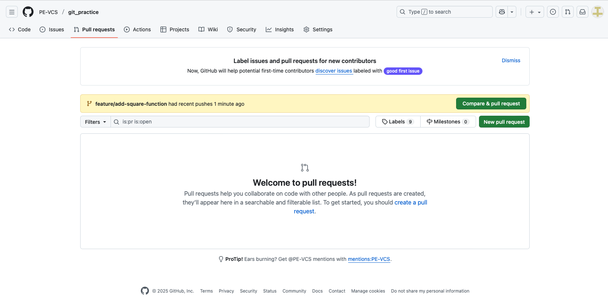
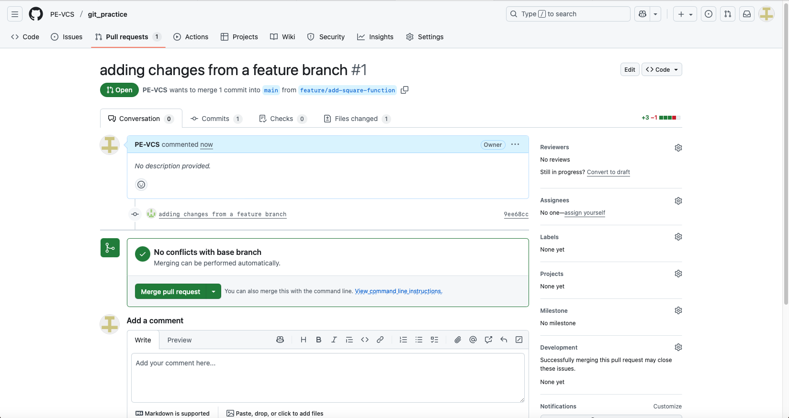
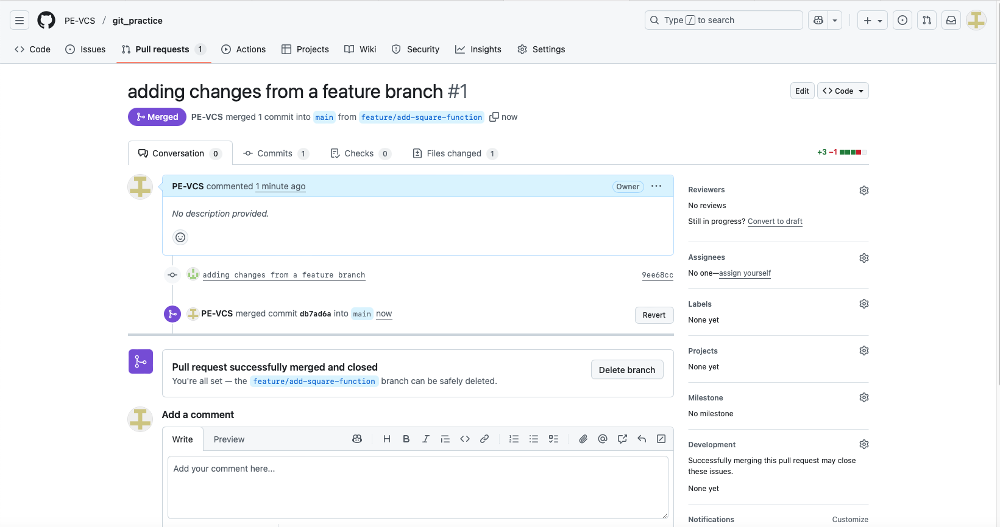

# Branching and Pull Requests

So far, you've been working directly on the `main` branch. While this works for solo projects, it's not how professional teams collaborate. Branches allow you to work on features, bug fixes, or experiments in isolation without affecting the main codebase. Pull Requests (PRs) provide a way to review code before merging it into the main branch.

In this lab, you'll learn how to create branches, switch between them, push branches to GitHub, create pull requests, review code, and merge changes—all essential skills for team collaboration.

### Estimated Time: 40 Minutes

**Prerequisites:** 
- Complete Labs 1.1 through 2.1
- Have your `git_practice` repository open in VS Code
- Be comfortable with basic Git operations in VS Code

## Part 1: Understanding Branches

**What are branches?**
- Branches are independent lines of development
- Think of them as parallel universes of your code
- You can experiment without breaking the main code
- Each branch has its own commits
- Branches can be merged back together

**Common branching workflows:**
- `main` branch: Production-ready code
- `feature/new-calculator-function`: New feature development
- `bugfix/division-error`: Fixing a specific bug
- `hotfix/security-patch`: Urgent fixes

**Why use branches?**
- Work on features without affecting production code
- Enable code review before merging (Pull Requests)
- Multiple developers can work simultaneously
- Easy to experiment and throw away bad ideas
- Clean commit history

## Part 2: Viewing Branches in VS Code

Let's explore the branching interface in VS Code.

1. Open your `git_practice` repository in VS Code

2. Look at the Status Bar (bottom-left)
   - You'll see the branch icon and "main"
   - This is your current branch

3. Click on "main" in the Status Bar
   - A dropdown appears showing all branches
   - Currently you only have "main"
   - You'll see options to create a new branch


4. Open the Source Control panel
   - Click the Source Control icon or press `Ctrl+Shift+G` / `Cmd+Shift+G`
   - Click the three dots **...**
   - Hover over **Branch**
   - You'll see branch-related commands


## Part 3: Creating a Branch in VS Code

Let's create your first feature branch to add a new calculator function.

1. Click on "main" in the Status Bar

2. Select "Create new branch..."
   - Type the branch name: `feature/add-square-function`
   - Press Enter


3. VS Code automatically switches to the new branch
   - Look at the Status Bar bottom left of VS code. It now shows "feature/add-square-function"
   - You're now working on this branch
   - The main branch is untouched

4. Verify in the integrated terminal
   ```bash
   # Open terminal (Ctrl+` or Cmd+`)
   git branch
   
   # Output shows:
   # * feature/add-square-function
   #   main
   # The * indicates your current branch
   ```

**What just happened?**
- VS Code ran: `git checkout -b feature/add-square-function`
- This creates a new branch AND switches to it
- All new commits will be on this branch only

## Part 4: Making Changes on a Branch

Now let's add the new feature to our branch.

1. Open `calculator.py`

2. Add a square function before the main block:
   ```python
   
   def square(a):
       """Return the square of a number"""
       return a ** 2
   ```

3. Update the main block to test it:
   ```python
   if __name__ == "__main__":
       print("Calculator loaded!")
       print(f"5 + 3 = {add(5, 3)}")
       print(f"10 - 4 = {subtract(10, 4)}")
       print(f"5 squared = {square(5)}")
   ```

4. Save the file (`Ctrl+S` / `Cmd+S`)

5. Stage and commit the changes
   - Go to Source Control
   - Stage `calculator.py`
   - Commit message: `Add square function to calculator`
   - Commit it

6. Notice the Status Bar
   - Next to the branch name, you'll see an up arrow with "1"
   - This means you have 1 commit to push on this branch

## Part 5: Merging Changes from Main (Important!)

Before pushing your branch and creating a PR, it's crucial to merge any changes from `main` into your feature branch. This ensures your branch is up-to-date and prevents conflicts later.

**Why merge from main regularly?**
- Other developers may have merged changes while you were working
- Your branch might become outdated
- Merge conflicts are easier to resolve early
- PRs are cleaner when your branch is current

### Check if Main Has New Changes

1. Switch to the main branch
   - Click the branch name in Status Bar
   - Select "main"

2. Pull latest changes from GitHub
   - Click the sync icon in Status Bar
   - Or press `Ctrl+Shift+P` / `Cmd+Shift+P` → "Git: Pull"

3. Check if there are new commits
   - If VS Code shows "pulling" or downloads commits, main had updates
   - If nothing happens, main was already up-to-date

### Merge Main into Your Feature Branch

4. Switch back to your feature branch
   - Click branch name → "feature/add-square-function"

5. Merge main into your feature branch (VS Code)
   - Open Command Palette (`Ctrl+Shift+P` / `Cmd+Shift+P`)
   - Type: "Git: Merge Branch"
   - Select "Git: Merge Branch"
   - Choose "main" from the list
   - VS Code merges main into your current branch

6. Alternative: Merge from terminal
   ```bash
   # Make sure you're on your feature branch
   git checkout feature/add-square-function
   
   # Merge main into current branch
   git merge main
   ```
7. Alternative: Merge without pulling or switching branches on terminal
   ```bash
   git fetch --all
   git branch # confirm you are in the feature branch
   git merge origin/main # origin/main always refers to remote repository
   ```

### What Happens During Merge

**If no conflicts:**
- Git automatically merges the changes
- Your branch now has the latest changes from main
- Your feature changes are preserved
- You might see a merge commit created

**If there are conflicts:**
- VS Code will show conflict markers in files
- You'll need to resolve conflicts (choose which changes to keep)
- Stage the resolved files
- Commit the merge

### Best Practice: Merge Often

**Good workflow:**
1. Start your day: Switch to main → Pull latest → Switch to feature branch → Merge main
2. Before creating PR: Merge main one final time
3. During long feature work: Merge main daily or every few days

**Commands for regular merging:**
```bash
# Quick update workflow
git checkout main
git pull
git checkout feature/add-square-function  
git merge main
```

This keeps your branch current and makes PRs much smoother!

## Part 6: Pushing a Branch to GitHub

Your branch exists locally. Let's push it to GitHub.

1. Push the branch (Option 1: Status Bar)
   - Click the sync icon in the Status Bar
   - VS Code will ask: "The branch 'feature/add-square-function' has no remote branch. Would you like to publish this branch?"
   - Click **Publish Branch**

2. Push the branch (Option 2: Command Palette)
   - Press `Ctrl+Shift+P` / `Cmd+Shift+P`
   - Type: "Git: Push"
   - Select it

3. Verify on GitHub
   - Go to your repository on GitHub
   - You'll see a notification: "feature/add-square-function had recent pushes"
   - Click the **Compare & pull request** button (we'll create the PR soon)


4. View branches on GitHub
   - Click the branch dropdown (shows "main" by default)
   - You'll see both branches listed: main and feature/add-square-function
   - Select View All Branches


## Part 7: Switching Between Branches in VS Code

Let's practice switching between branches to understand how they're independent.

1. View your current changes
   - `calculator.py` has the square function
   - Open it to confirm

2. Switch to main branch (Option 1: Status Bar)
   - Click the branch name in the Status Bar
   - Select "main" from the dropdown

3. Watch the magic happen
   - VS Code switches branches
   - Look at `calculator.py` again
   - The square function is GONE! (It's only on the feature branch)
   - The Status Bar now shows "main"

4. Switch back to the feature branch
   - Click the branch name again
   - Select "feature/add-square-function"
   - The square function reappears!

**Understanding what happened:**
- Branches have different versions of files
- Switching branches changes your working directory
- Each branch is completely independent
- No changes are lost—they're just on different branches

## Part 8: Command Line Branch Operations

While VS Code makes branching easy, it's important to understand the Git commands behind it.

1. Open the integrated terminal

2. **View all branches:**
   ```bash
   git branch
   
   # Output:
   # * feature/add-square-function
   #   main
   ```

3. **Create a new branch (without switching):**
   ```bash
   git branch feature/add-cube-function
   
   # Creates the branch but doesn't switch to it
   git branch
   # Shows all three branches
   ```

4. **Create and switch to a branch in one command:**
   ```bash
   git checkout -b bugfix/calculator-typo
   
   # Same as:
   # git branch bugfix/calculator-typo
   # git checkout bugfix/calculator-typo
   ```

5. **Switch between branches:**
   ```bash
   git checkout main
   # Switched to branch 'main'
   
   git checkout feature/add-square-function
   # Switched to branch 'feature/add-square-function'
   ```

6. **Delete a local branch:**
   ```bash
   # Switch to a different branch first
   git checkout main
   
   # Delete a branch (safe delete - won't delete if unmerged)
   git branch -d feature/add-cube-function
   
   # Force delete (use cautiously!)
   git branch -D bugfix/calculator-typo
   ```

7. **View remote branches:**
   ```bash
   git branch -r
   
   # Shows branches on GitHub
   ```

8. **View all branches (local and remote):**
   ```bash
   git branch -a
   ```

**Key Commands Summary:**
- `git branch` - List local branches
- `git branch <name>` - Create a branch
- `git checkout <name>` - Switch to a branch
- `git checkout -b <name>` - Create and switch to a branch
- `git branch -d <name>` - Delete a branch (safe)
- `git branch -D <name>` - Force delete a branch
- `git branch -r` - List remote branches
- `git branch -a` - List all branches

## Part 9: Creating a Pull Request on GitHub

A Pull Request (PR) is a request to merge your branch into another branch (usually main). It enables code review and discussion.

1. Go to your repository on GitHub

2. You'll see the notification about your recent push
   - Click the **Compare & pull request** button
   - If the notification disappears go to the pull request tab



3. Fill out the Pull Request form
   - **Base branch**: main (where you want to merge TO)
   - **Compare branch**: feature/add-square-function (what you want to merge)
   - **Title**: "Add square function to calculator"
   - **Description**: Add details:
     ```
     ## Changes
     - Added square() function to calculator.py
     - Updated main block to test the new function
     
     ## Testing
     - Tested with square(5) = 25
     - Function works as expected
     ```


4. Review the changes
   - Scroll down to see the "Files changed" section
   - GitHub shows the diff—what's being added/removed
   - Green lines show additions
   - Red lines show deletions (if any)


5. Create the Pull Request
   - Click the green **Create pull request** button
   - You now have an open PR!



## Part 10: Reviewing a Pull Request

Now let's act as a code reviewer and inspect the PR.

1. You're now on the Pull Request page
   - **Conversation tab**: Comments and discussion
   - **Commits tab**: See all commits in this PR
   - **Files changed tab**: Review the code changes

2. Click the **Files changed** tab

3. Review the code
   - Hover over any line of code
   - A blue **+** icon appears
   - Click it to add a comment on that line

4. Add a review comment
   - Click the + next to a line in the square function
   - Type a comment: "Good implementation! Consider adding input validation for negative numbers if needed."
   - Click **Start a review**

5. Add more comments if desired
   - You can comment on multiple lines
   - Comments are batched in a review

6. Submit your review
   - Click the **Review changes** button (top right)
   - You'll see three options:
     - **Comment**: Just add comments without approval
     - **Approve**: Accept the changes
     - **Request changes**: Block merging until changes are made
   - Select **Approve**
   - Add a summary comment: "Looks good! Ready to merge."
   - Click **Submit review**


**What you learned:**
- PRs enable code review before merging
- You can comment on specific lines
- Reviewers can approve, comment, or request changes
- Reviews improve code quality and share knowledge


## Part 11: Merging a Pull Request

Now let's merge your approved PR into main.

1. Go to your Pull Request
   - Click **Pull requests** tab
   - Click on your open PR

2. Scroll to the bottom
   - You'll see: "This branch has no conflicts with the base branch"
   - You'll see the green **Merge pull request** button
   - If there were merge conflicts, you'd need to resolve them first

3. Merge the PR
   - Click **Merge pull request**
   - You can edit the commit message if desired
   - Click **Confirm merge**

4. Success!
   - You'll see: "Pull request successfully merged and closed"
   - The PR is now marked as merged (purple icon)
   - You'll see an option to delete the branch



5. Delete the branch on GitHub (optional but recommended)
   - Click **Delete branch**
   - Keeps your repository clean
   - You can always restore it later if needed

## Part 12: Pulling Changes Back to VS Code

Your main branch on GitHub now has the new square function, but your local main branch doesn't yet.

1. In VS Code, switch to the main branch
   - Click the branch name in the Status Bar
   - Select "main"

2. Open `calculator.py`
   - Notice: NO square function yet (your local main is behind)

3. Pull the changes from GitHub
   - Click the sync icon in the Status Bar
   - Or use Source Control menu → Pull
   - VS Code downloads the merged changes

4. Check `calculator.py` again
   - The square function is now there!
   - Your local main branch is now up to date with GitHub

5. Clean up the local feature branch
   - Open the integrated terminal
   ```bash
   # Delete the local feature branch (it's merged now)
   git branch -d feature/add-square-function
   
   # If it says "not fully merged", use:
   # git branch -D feature/add-square-function
   ```

6. Verify your branches
   ```bash
   git branch
   
   # Should only show:
   # * main
   ```

**The complete workflow:**
1. Create a feature branch
2. Make changes and commit
3. Push the branch to GitHub
4. Create a Pull Request
5. Review and discuss the code
6. Merge the PR on GitHub
7. Pull changes to local main
8. Delete the feature branch (local and remote)

## Part 13: Practice - Complete Feature Workflow

Let's do the entire workflow one more time to solidify your understanding.

**Task:** Add a cube function to the calculator.

1. **Create a new branch in VS Code**
   - Click branch name → "Create new branch..."
   - Name: `feature/add-cube-function`

2. **Make the changes**
   - Open `calculator.py`
   - Add a cube function:
     ```python
     
     def cube(a):
         """Return the cube of a number"""
         return a ** 3
     ```
   - Update the main block to test it:
     ```python
     print(f"3 cubed = {cube(3)}")
     ```
   - Save the file

3. **Commit the changes**
   - Stage, commit with message: "Add cube function to calculator"

4. **Merge latest changes from main (important!)**
   - Switch to main branch → Pull latest changes
   - Switch back to your feature branch
   - Command Palette → "Git: Merge Branch" → Select "main"
   - This ensures your branch is up-to-date before creating the PR

5. **Push the branch**
   - Click sync icon → Publish Branch

6. **Create a Pull Request on GitHub**
   - Go to GitHub
   - Click "Compare & pull request"
   - Title: "Add cube function"
   - Description: Explain what you added
   - Create the PR

7. **Review your own PR**
   - Go to Files changed
   - Add a comment on your code
   - Approve the review

8. **Merge the PR**
   - Click "Merge pull request"
   - Confirm the merge
   - Delete the branch on GitHub

9. **Update your local main**
   - Switch to main in VS Code
   - Pull the changes
   - Delete the local feature branch:
     ```bash
     git branch -d feature/add-cube-function
     ```

**Congratulations!** You've completed a full feature development workflow using branches and Pull Requests!

## Part 14: Working with Remote Branches

Sometimes you need to work with branches that others created on GitHub.

1. **Fetch all remote branches**
   ```bash
   # Download info about all remote branches
   git fetch --all
   
   # View remote branches
   git branch -r
   ```

2. **Check out a remote branch**
   ```bash
   # If someone else created a branch on GitHub:
   git checkout -b feature/their-branch origin/feature/their-branch
   
   # Shorter version (Git figures it out):
   git checkout feature/their-branch
   ```

3. **In VS Code:**
   - Click branch dropdown
   - You'll see remote branches listed
   - Click one to create a local tracking branch

## Part 15: Branch Naming Best Practices

Good branch names make collaboration easier.

**Recommended patterns:**
- `feature/description` - New features
  - `feature/user-authentication`
  - `feature/dark-mode`
- `bugfix/description` - Bug fixes
  - `bugfix/login-error`
  - `bugfix/typo-in-readme`
- `hotfix/description` - Urgent production fixes
  - `hotfix/security-vulnerability`
- `refactor/description` - Code improvements
  - `refactor/simplify-calculator`
- `docs/description` - Documentation updates
  - `docs/api-examples`

**Best practices:**
- Use lowercase and hyphens (not underscores or spaces)
- Be descriptive but concise
- Include issue number if applicable: `feature/123-add-search`
- Avoid special characters
- Delete branches after merging

## Cleanup

Keep your repository! You've learned the full branching and PR workflow.

**Clean state check:**
```bash
# Should only show main branch
git branch

# Should be on main and up to date
git status

# Should have all merged features
cat calculator.py
```

## Conclusion

In this lab, you mastered Git branching and GitHub Pull Requests:

- **Branch basics**: Understanding what branches are and why they're essential
- **Creating branches**: In VS Code (GUI) and command line (`git checkout -b`)
- **Switching branches**: Understanding how files change between branches
- **Command line operations**: `git branch`, `git checkout`, `git branch -d`
- **Pushing branches**: Publishing branches to GitHub
- **Pull Requests**: Creating, reviewing, and merging PRs on GitHub
- **Code review**: Adding comments, approving changes, requesting modifications
- **Viewing branches on GitHub**: Branch dropdown and branches page
- **Merging workflow**: Complete cycle from branch creation to merged PR
- **Cleanup**: Deleting merged branches locally and remotely
- **Branch naming**: Professional naming conventions

**Key Workflow:**
1. Always create a branch for new work
2. Make focused, related changes
3. Push and create a PR
4. Have someone review (or review yourself for learning)
5. Merge when approved
6. Delete the branch
7. Pull changes to local main

**Professional Benefits:**
- Safe experimentation without breaking main
- Code review before merging
- Clear history of what changed and why
- Multiple people can work simultaneously
- Easy to revert if something goes wrong

## Next Steps

- Practice creating feature branches for any new work
- Try creating a branch, making conflicting changes on main, and resolving merge conflicts in a PR
- Explore GitHub's branch protection rules (require reviews, prevent force push)
- Learn about Git Flow and other branching strategies
- Practice reviewing other developers' Pull Requests
- Explore GitHub Actions for automated testing on PRs
