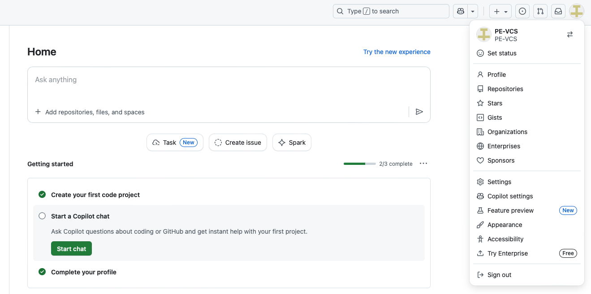
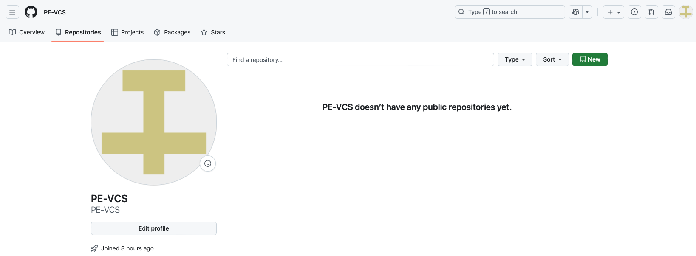
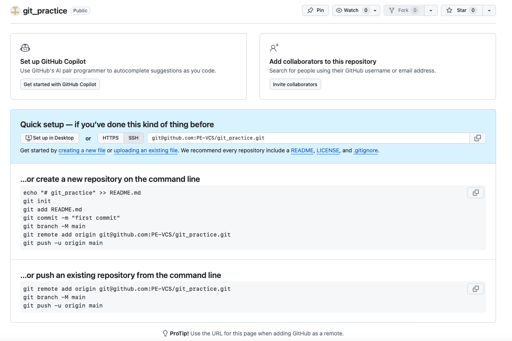

# Introduction to GitHub

GitHub is a web-based platform for hosting Git repositories, enabling collaboration, code sharing, and version control in the cloud. While Git manages version control locally on your computer, GitHub provides a remote location to store your code, collaborate with others, and showcase your projects to the world.

Understanding GitHub is essential for modern software development and DevOps workflows. Whether you're contributing to open-source projects, collaborating with a team, or building a portfolio of your work, GitHub serves as the industry-standard platform for hosting and managing code.

In this lab, you'll take the local Git repository you created in Lab 1.1 and push it to GitHub, making your code accessible from anywhere and ready for collaboration.

### Estimated Time: 25 Minutes

**Prerequisites:** Complete Lab 1.1 (Introduction to Git Bash). You should have a `git_practice` folder with committed files.

## Part 1: Creating a GitHub Account

If you don't already have a GitHub account, you'll need to create one.

1. Navigate to GitHub
   - Open your web browser and go to [https://github.com](https://github.com)

2. Sign up for a free account
   - Click the **Sign up** button in the top right corner
   - Enter your email address
   - Create a password (use a strong password!)
   - Choose a username (this will be part of your GitHub URL)
   - Complete the verification puzzle

3. Verify your email address
   - Check your email for a verification code from GitHub
   - Enter the code to verify your account

4. Complete the welcome survey (optional)
   - GitHub may ask about your experience level and interests
   - You can skip this or fill it out—it helps customize your experience

**Congratulations!** You now have a GitHub account.

## Part 2: Exploring the GitHub Interface

Let's familiarize ourselves with GitHub's main interface.

1. View your profile
   - Click your profile icon in the top right corner
   - Select **Your profile** from the dropdown



2. Explore your profile page
   - This is where your repositories and contributions will appear
   - Notice the **Repositories** tab
   - Your profile URL is: `https://github.com/yourusername`



3. Navigate to your repositories
   - Click the **Repositories** tab on your profile
   - Or click your profile icon → **Your repositories**
   - This shows all repositories you own or contribute to


## Part 3: Verifying Your Local Repository

Before creating a GitHub repository, let's make sure your local repository from Lab 1.1 is ready.

1. Open Git Bash and navigate to your git_practice folder
   ```bash
   cd ~/Documents/git_practice
   
   # Verify you're in the right place
   pwd
   ```

2. Check the repository status
   ```bash
   # View Git status
   git status
   
   # Should show "On branch main" and "nothing to commit, working tree clean"
   ```

3. View your commit history
   ```bash
   # See all commits you've made
   git log --oneline
   
   # You should see your commits from Lab 1.1
   ```

4. List your files
   ```bash
   # See what files you have
   ls -la
   
   # You should see: README.md, hello.py, notes.txt, .gitignore, .env, .git/
   ```

If anything is missing or you get errors, go back and complete Lab 1.1 first!

## Part 4: Creating a GitHub Repository for Your Local Project

Now let's create a repository on GitHub to host your local `git_practice` project.

1. Create a new repository
   - Click the **+** icon in the top right corner
   - Select **New repository**

2. Configure your repository
   - **Repository name**: `git_practice` (match your local folder name)
   - **Description**: "My first GitHub repository for learning Git"
   - **Public or Private**: Choose **Public** (so you can share it)
   - **Important**: Do NOT check "Add a README file"
   - **Important**: Do NOT add .gitignore or license
   - Click **Create repository**


   **Why no README?** Because you already have one locally! Adding it here would create conflicts.

3. GitHub shows quick setup instructions
   - You'll see a page with setup commands
   - We'll use the **"push an existing repository"** section



## Part 5: Connecting Your Local Repository to GitHub

Now let's link your local `git_practice` folder to the GitHub repository you just created.

1. Make sure you're in your git_practice directory
   ```bash
   cd ~/Documents/git_practice
   pwd
   ```

2. Add GitHub as the remote origin
   ```bash
   # Replace 'yourusername' with your actual GitHub username
   git remote add origin https://github.com/yourusername/git_practice.git
   ```

   This tells Git where to push your code on GitHub.

3. Verify the remote was added
   ```bash
   git remote -v
   ```

   You should see your GitHub repository URL listed twice (for fetch and push).

4. Rename your branch to 'main' (if needed)
   ```bash
   # Make sure you're on the main branch
   git branch -M main
   ```

## Part 6: Pushing Your Code to GitHub

Time to upload your local commits to GitHub!

1. Push your code for the first time
   ```bash
   # Push to GitHub
   git push -u origin main
   ```

   The `-u` flag sets `origin main` as the default, so future pushes just need `git push`.

2. **Authentication will happen automatically:**
   - Git Credential Manager (GCM) will open your web browser
   - You'll be taken to GitHub's login page
   - Log in with your GitHub username and password
   - Authorize Git Credential Manager
   - A secure token is created and stored in Windows Credential Manager

3. **Verify the push succeeded:**
   ```bash
   # You should see output like:
   # Enumerating objects: X, done.
   # Counting objects: 100% (X/X), done.
   # Writing objects: 100% (X/X), done.
   # To https://github.com/yourusername/git_practice.git
   #  * [new branch]      main -> main
   ```

**Success!** Your local repository is now on GitHub!

## Part 7: Viewing Your Repository on GitHub

Let's verify that your code is now on GitHub and explore what GitHub has to offer.

1. Go to your repository on GitHub
   - Open your browser and navigate to: `https://github.com/yourusername/git_practice`
   - Or click the repository link from your GitHub profile


2. Notice what's there:
   - All your files: `README.md`, `hello.py`, `notes.txt`
   - `.gitignore` is there (but `.env` is NOT - it's being ignored!)
   - Your commit messages appear next to each file
   - The commit count shows all your commits
   - The README.md content is automatically displayed at the bottom of the page

3. Explore the repository tabs
   - **Code**: The main view showing your files
   - **Issues**: Track bugs, tasks, and feature requests (empty for now)
   - **Pull requests**: For collaborative code reviews (we'll learn about these later)
   - **Actions**: Automated workflows and CI/CD (advanced topic)
   - **Projects**: Project management boards (like Trello for your code)
   - **Settings**: Repository configuration and options

4. Click on files to view their contents
   - Click on `README.md` to see it rendered with Markdown formatting
   - Click on `hello.py` to see your Python script with syntax highlighting
   - Notice `.env` is missing - that's good! It's excluded by `.gitignore`

5. **Explore the Settings tab** (take 2-3 minutes here)
   - Click the **Settings** tab at the top
   - Browse through the sidebar options:
     - **General**: Change repository name, description, visibility
     - **Collaborators**: Invite others to contribute (try adding a friend!)
     - **Branches**: Protect important branches from accidental changes
     - **Pages**: Turn your repository into a website (great for portfolios!)
     - **Security**: Set up security policies and advisories
   - Don't change anything yet, just explore what's available
   - These settings become very important as your projects grow

## Part 8: Viewing Commit History on GitHub

GitHub makes it easy to explore your project's history and see exactly what changed over time.

1. View all commits
   - Go back to the main **Code** tab of your repository
   - Click the commit count (e.g., "3 commits") near the top of the page
   - You'll see all commits you made in Lab 1.1 listed chronologically


2. Click on a specific commit
   - Click any commit message to see the details
   - You'll see exactly what changed in that commit
   - Green lines (with +) show additions
   - Red lines (with -) show deletions
   - This is called a "diff" (difference between versions)

3. Navigate back to your repository
   - Click the repository name at the top to return to the main view

## Part 9: Making More Changes and Pushing Again

Now let's practice the full workflow: make local changes, commit, and push to GitHub.

1. Navigate to your repository (if not already there)
   ```bash
   cd ~/Documents/git_practice
   ```

2. Create a new file
   ```bash
   echo "# To Do" > todo.txt
   echo "- Learn Git" >> todo.txt
   echo "- Push to GitHub" >> todo.txt
   echo "- Collaborate with others" >> todo.txt
   
   # View it
   cat todo.txt
   ```

3. Update your README
   ```bash
   echo "" >> README.md
   echo "## Project Status" >> README.md
   echo "Successfully pushed to GitHub!" >> README.md
   ```

4. Stage, commit, and push
   ```bash
   # Check what changed
   git status
   
   # Stage everything
   git add --all
   
   # Commit
   git commit -m "Add todo list and update README"
   
   # Push to GitHub
   git push
   ```

   Notice you can just use `git push` now (no need for `origin main`)!

5. Verify on GitHub
   - Refresh your repository page on GitHub in your browser
   - You should see `todo.txt` in the file list
   - The commit count increased by 1
   - Click on the latest commit to see your changes

This is the core Git/GitHub workflow you'll use every day!


## Part 10: The Complete Workflow

Understanding the relationship between local and remote repositories is crucial.

1. **The basic workflow:**
   ```
   Local Computer (Git Bash)   GitHub (Web)
   ─────────────────────────   ────────────
   1. Make changes locally
   2. git add (stage)
   3. git commit (save)    →     
   4. git push             →   5. Changes appear on GitHub
   ```

2. **Key commands you've learned:**
   ```bash
   # See where your repository is connected
   git remote -v
   
   # Check status of your files
   git status
   
   # Stage and commit
   git add --all
   git commit -m "Your message"
   
   # Push to GitHub
   git push
   
   # (Later: Pull changes from GitHub)
   git pull
   ```

3. **Best practice workflow:**
   - Make changes locally in Git Bash or your editor
   - Test your code
   - Use `git status` to see what changed
   - Stage with `git add`
   - Commit with a clear message
   - Push to GitHub with `git push`
   - Verify on GitHub web interface

## Part 11: Editing Files Directly on GitHub

You can also edit files directly on GitHub's website and pull those changes back to your computer.

1. Edit a file on GitHub
   - Go to your `git_practice` repository on GitHub
   - Click on `README.md` to view it
   - Click the pencil icon in the top right to edit

2. Make some changes
   - Add a new line at the bottom: `## About Me`
   - Add another line: `Learning Git and GitHub for the first time!`
   - Scroll down to the "Commit changes" section
   - Add a commit message: "Update README on GitHub"
   - Click the green **Commit changes** button

3. Pull the changes to your local repository
   ```bash
   # Make sure you're in git_practice
   cd ~/Documents/git_practice
   
   # Pull changes from GitHub
   git pull
   
   # View the updated README
   cat README.md
   ```

   You'll see the changes you made on GitHub now appear locally! This is the reverse workflow: GitHub → Local.

## Part 12: Understanding Markdown

The `README.md` file uses Markdown formatting. Here are some basics:

```markdown
# Heading 1
## Heading 2
### Heading 3

**bold text**
*italic text*

- Bullet point
- Another bullet

1. Numbered list
2. Second item

[Link text](https://example.com)

`code snippet`
```

Your README.md automatically renders with formatting on GitHub's main page!

## Part 13: Cloning Your Repository

Now let's complete the full circle: you created a local repository, pushed it to GitHub, and now you'll clone it back from GitHub. This proves your code truly lives in the cloud and can be accessed from anywhere.

1. Delete your local git_practice folder
   ```bash
   # Navigate out of the git_practice directory
   cd ~/Documents
   
   # Delete the folder (be careful with this command!)
   rm -rf git_practice
   
   # Verify it's gone
   ls
   ```

   Don't worry—your code is safe on GitHub!

2. Clone your repository from GitHub
   ```bash
   # Clone from GitHub (replace 'yourusername' with your actual username)
   git clone https://github.com/yourusername/git_practice.git
   
   # You'll see:
   # Cloning into 'git_practice'...
   # remote: Counting objects: X, done.
   # Receiving objects: 100% (X/X), done.
   ```

3. Verify everything is back
   ```bash
   # Navigate into the cloned repository
   cd git_practice
   
   # List all files
   ls -la
   
   # You should see all your files: README.md, hello.py, notes.txt, todo.txt, .gitignore
   # Notice .env is NOT here—it was never pushed (thanks to .gitignore!)
   ```

4. Check the Git history
   ```bash
   # View commit history
   git log --oneline
   
   # All your commits are here!
   ```

5. Verify the remote connection
   ```bash
   # Check remote
   git remote -v
   
   # It's automatically connected to GitHub
   ```

**What just happened?**
- You deleted your local work completely
- You cloned it back from GitHub
- All files, commits, and history are intact
- This proves GitHub is a true backup and collaboration tool

**Real-world use case:**
- You'll use `git clone` to work on team projects
- Clone open-source repositories to contribute
- Work from multiple computers (home laptop, work desktop, etc.)
- Recover if your computer crashes (as long as you pushed to GitHub!)

## Cleanup

**Keep your repository!** It's useful for practice and shows your learning progress. You just cloned it fresh, so it's a clean copy from GitHub.

If you want to delete everything later:

**To delete the GitHub repository:**
- Go to your repository on GitHub
- Click **Settings**
- Scroll to the bottom to "Danger Zone"
- Click **Delete this repository**
- Type the repository name to confirm


**To delete your local folder:**
```bash
cd ~/Documents
rm -rf git_practice
```

## Conclusion

In this lab, you extended your Git knowledge to GitHub and learned how local and remote repositories work together:

- **GitHub account**: Creating and setting up your GitHub profile
- **GitHub interface**: Navigating repositories, commits, files, and settings
- **Connecting repositories**: Linking your local git_practice repository to GitHub with `git remote add`
- **Pushing code**: Uploading your local commits to GitHub with `git push`
- **Authentication**: Using OAuth/browser authentication with Git Credential Manager
- **Viewing on GitHub**: Seeing your code, commits, and history on GitHub's web interface
- **Editing on GitHub**: Making changes directly on GitHub and pulling them back locally with `git pull`
- **Cloning**: Downloading a repository from GitHub with `git clone`
- **Markdown basics**: Understanding how README.md files display formatted content
- **The workflow**: Understanding the complete push-pull cycle between local and remote

By building on the `git_practice` repository from Lab 1.1, you've experienced a real-world workflow: developing locally with Git, then publishing to GitHub for backup and collaboration.

GitHub transforms Git from a local version control tool into a collaborative platform. You can now:
- Share your code with others
- Contribute to open-source projects
- Build a portfolio of your work
- Collaborate with teams on the same codebase
- Backup your code in the cloud

## Next Steps

- Explore public repositories to see how others organize their code
- Star repositories you find interesting
- Practice the clone → edit → commit → push workflow
- Learn about branches for working on features independently
- Explore GitHub Issues for tracking bugs and tasks
- Try forking a repository to contribute to open-source projects
