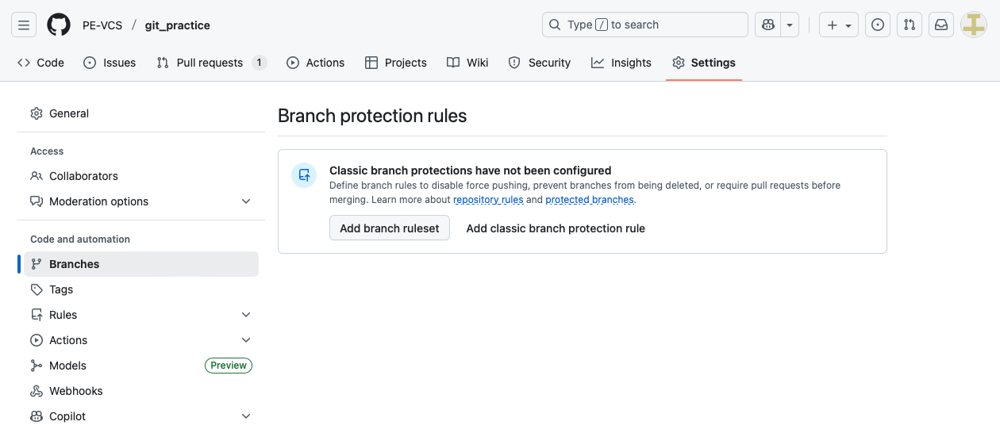
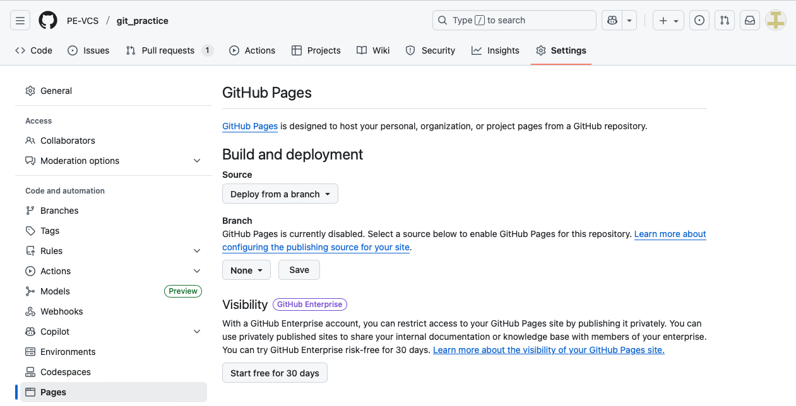

# Lab 2.5: Repository Settings Overview

## Introduction

GitHub repositories offer extensive configuration options to control features, manage access, and customize your development workflow. In this lab, you'll explore the main repository settings sections and understand what each one controls.

**By the end of this lab, you will:**
- Navigate the repository settings interface
- Understand the purpose of each main settings section
- Configure basic repository features
- Adjust collaboration and access settings
- Know where to find advanced options

**Estimated Time:** 20 minutes

---

## Part 1: Accessing Repository Settings

### Opening Settings

1. Go to one of your repositories on GitHub (you can use `git_practice` from previous labs)

2. Click the **Settings** tab (far right in the repository menu)
   - **Note:** You must be the repository owner or have admin access to see this tab
   - If you don't see Settings, you don't have admin permissions

3. Notice the left sidebar with different settings categories


> **Note:** GitHub may update their interface over time, so the exact layout might differ slightly from what you see here. The core settings will remain similar.

### Settings Sidebar Overview

Take a moment to look at the left sidebar. You'll see sections like:

- **General** - Basic repository configuration
- **Access** - Collaborators and teams (you used this in Lab 2.3)
- **Code and automation** - Branches, Pages, Actions
- **Security** - Code security and analysis
- **Secrets and variables** - Sensitive information storage
- **Integrations** - Webhooks and GitHub Apps

We'll explore the most important ones for beginners.

---

## Part 2: General Settings

Click **General** in the left sidebar (should already be selected).

### Repository Basics

Near the top, you'll see:

**Repository name**
- You can rename your repository here
- **Be careful!** Renaming changes the URL and breaks existing clones

**Description**
- Add a short description of your repository
- This appears on the repository's main page

**Try it:** Update your description to something like "Learning Git and GitHub workflows"

### Features

Scroll down to the **Features** section. This is where you enable/disable major repository features.

**What each feature does:**

**Issues** - Bug tracking and task management
- Essential for most projects
- Teams use this to track bugs, features, and tasks
- **Keep this enabled**

**Wikis** - Documentation wiki
- Separate from your code
- Good for project guides, FAQs, tutorials
- Optional for small projects

**Discussions** - Community forum
- Like a discussion board attached to your repo
- Useful for open source projects or Q&A
- Optional for learning/personal projects

**Projects** - Kanban-style project boards
- Organize issues and tasks visually
- Similar to Trello
- Optional - good for larger projects

**Try it:** Enable **Wikis** if it's not already enabled (we'll use it in a moment)

### Danger Zone

Scroll to the very bottom. You'll see a red **Danger Zone** section.


This section contains destructive actions:
- **Archive** - Make repository read-only
- **Transfer ownership** - Move to different account
- **Delete repository** - Permanent deletion

**⚠️ Don't click anything here!** These actions are hard to undo.

---

## Part 3: Collaborators (Quick Review)

Click **Collaborators** in the left sidebar.


You used this in Lab 2.3 to add a partner to your repository.

**What you can do here:**
- Add people to your repository
- See pending invitations
- Remove collaborators
- Manage access levels (Read, Write, Admin)

**No need to make changes here** - just remember where this is when you need to add team members.

---

## Part 4: Key Settings to Know About

Let's quickly explore a few other important settings sections. You won't configure them now, but it's good to know they exist.

### Branches

Click **Branches** under "Code and automation".



**What this is for:**
- Set your default branch (usually `main`)
- **Branch protection rules** - We'll cover this in Lab 2.5!
- Prevent accidental deletion or force-pushes

### Pages

Click **Pages** under "Code and automation".



**What this is for:**
- Host a **free website** directly from your repository
- Great for project documentation, portfolios, blogs
- Deploys automatically when you push

**Example uses:**
- Project documentation site
- Personal portfolio
- Team blog

### Actions

Click **Actions** → **General** under "Code and automation".

**What this is for:**
- **Automated workflows** (CI/CD)
- Run tests automatically when you push
- Deploy code automatically
- Schedule tasks

**Example uses:**
- Run unit tests on every PR
- Deploy to production on merge
- Generate reports nightly

### Secrets and Variables

Click **Secrets and variables** → **Actions**.

**What this is for:**
- Store **sensitive information** securely
- **Secrets**: API keys, passwords (encrypted, hidden)
- **Variables**: Configuration values (not secret)

**Why this matters:**
- Never commit passwords or API keys to your code
- Store them here instead
- Use them in GitHub Actions workflows

---

## Part 5: Trying Out a Feature - Wikis

Let's actually use one of the features you enabled.

### Create Your First Wiki Page

1. Click your repository name at the top to go back to the main page

2. Click the **Wiki** tab (next to Settings)

3. Click **Create the first page**

![Wiki Creation Page]

4. The title defaults to "Home" - keep it

5. Add some content:
   ```markdown
   # Git Practice Wiki
   
   ## What I've Learned
   
   - Git basics (add, commit, push)
   - Working with GitHub
   - Collaborating with others
   - Repository settings
   
   ## Useful Resources
   
   - [GitHub Docs](https://docs.github.com)
   - [Git Documentation](https://git-scm.com/doc)
   ```

6. Click **Save page**

7. Your wiki is now live! You can:
   - Add more pages
   - Link between pages
   - Use Markdown formatting

**Why use a wiki?**
- Separate documentation from code
- Easy to edit without pull requests
- Good for guides, FAQs, tutorials

---

## Part 6: Trying Out a Feature - Issues

Let's create a test issue to see how issue tracking works.

### Create Your First Issue

1. Click your repository name to go back to the main page

2. Click the **Issues** tab

3. Click **New issue**

![New Issue Page]

4. Fill it out:
   - **Title**: "Add more examples to README"
   - **Description**:
     ```markdown
     ## Description
     The README could use more examples of Git commands.
     
     ## Suggested additions
     - [ ] Add git log examples
     - [ ] Add git branch examples
     - [ ] Add screenshots
     ```

5. Click **Submit new issue**

6. Notice your issue gets a number (like #1 or #2)

### Explore Issue Features

7. Try these features:
   - Click **Labels** → Add "enhancement" label
   - Click **Assignees** → Assign to yourself
   - Add a comment: "I'll work on this next week"

8. Click **Close issue** (we're just testing)

**Why use issues?**
- Track bugs and feature requests
- Organize work with labels
- Reference in commits (e.g., "Fix #1")
- Great for team collaboration

---

## Part 7: Understanding Access Levels

Not everyone who can see your repository can change its settings.

### Settings Visibility

**Who can access Settings:**
- ✅ Repository owner (you)
- ✅ Users with Admin access
- ❌ Collaborators with Write access
- ❌ Collaborators with Read access

### Testing This

If you added a collaborator in Lab 2.3:

1. Have them visit your repository
2. They should **NOT** see a Settings tab
3. They can view code, create PRs, create issues
4. But they **cannot** change repository settings

**Why this matters:**
- Protects important settings from accidental changes
- Only trusted admins can configure protection rules
- Collaborators can still contribute without admin access

---

## Part 8: What You Should Remember

You don't need to memorize everything in Settings. Just remember:

### Most Important Settings (Know where to find them)

**General**
- ✅ Repository name and description
- ✅ Enable/disable features (Issues, Wikis)
- ⚠️ Danger Zone (delete, archive)

**Collaborators**
- ✅ Add team members
- ✅ Manage access levels

**Branches**
- ✅ Branch protection rules (Lab 2.5)
- ✅ Default branch

**Pages**
- 📄 Free website hosting

**Actions**
- 🤖 Automated workflows (CI/CD)

**Secrets and Variables**
- 🔒 Store API keys and passwords safely

### Settings You'll Use Later

As you grow as a developer, you'll explore:
- GitHub Actions for automation
- GitHub Pages for documentation sites
- Webhooks for integrations
- Security features (Dependabot)
- Advanced branch protection

**For now:** Focus on the basics (General, Collaborators, Branches)

---

## Cleanup

No cleanup needed! You just explored settings and enabled a few features.

**What you created:**
- ✅ Wiki page (can keep or delete)
- ✅ Test issue (already closed)

Everything else was just browsing.

---

## Conclusion

Congratulations! You've explored GitHub repository settings. You learned:

- **Accessing settings**: Where to find the Settings tab
- **Settings categories**: Understanding the left sidebar navigation
- **General settings**: Repository name, description, and features
- **Key features**: Issues, Wikis, Pages, Actions, Secrets
- **Hands-on practice**: Created a wiki page and test issue
- **Access control**: Who can see and change settings
- **What matters now**: Focus on basics, explore advanced features later

**Key Takeaways:**

1. **Settings are powerful**: Lots of options, but start simple

2. **Not everything is urgent**: Know where things are, use them when needed

3. **Features are modular**: Enable what you need (Issues, Wikis)

4. **Access is controlled**: Only admins can change settings

5. **GitHub keeps evolving**: The interface may change, but core settings remain

## Next Steps

- **Lab 2.5**: Configure branch protection rules (important!)
- Explore GitHub Pages when you want to host a project site
- Learn GitHub Actions when you're ready for automation
- Add Dependabot alerts to stay secure
- Experiment with different features as you need them

## Reflection Questions

1. Which repository features would be most useful for a team project?
2. Why is it important that collaborators can't access all settings?
3. When would you use a Wiki versus a README file?
4. What's the difference between Secrets and Variables?
5. How do Issues help organize project work?

**Well done on learning to navigate GitHub repository settings!**
