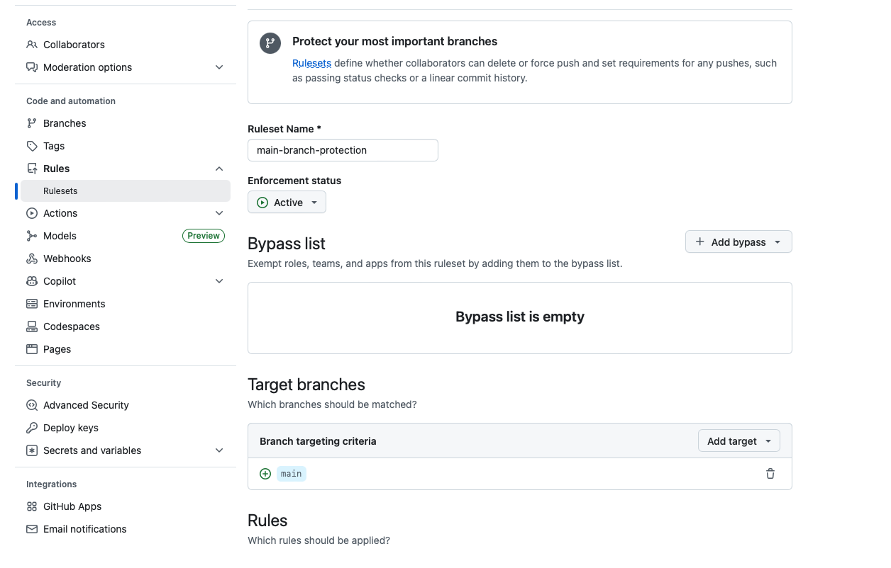

# Lab 3.1: Branch Protection Rules

## Introduction

Branch protection rules are GitHub's way of enforcing quality standards and preventing dangerous changes to important branches. In this lab, you'll configure protection rules that prevent direct pushes to `main`, require pull request reviews, and enforce conversation resolution.

**By the end of this lab, you will:**
- Understand why branch protection is important
- Configure branch protection rules on the `main` branch
- Test enforcement when trying to push directly to `main`
- Require pull request approvals before merging
- Require comment resolution before merging
- Experience the protected workflow from browser and command line

**Estimated Time:** 30 minutes

---

## Part 1: Understanding Branch Protection

### Why Protect Branches?

Without protection, anyone with write access can:
- Push directly to `main` without review
- Delete important branches
- Force push and rewrite history
- Bypass team processes

**Problems this causes:**
- Bugs slip into production
- No code review means missed issues
- Breaking changes without warning
- Loss of code quality standards

**Branch protection solves this by:**
- Forcing the PR workflow
- Requiring code review
- Ensuring discussions happen
- Maintaining code quality gates

### Common Protection Rules

Here are the most useful rules you can enforce:

**Require Pull Requests**
- No direct pushes to protected branch
- All changes must go through a PR
- Forces code review workflow

**Require Approvals**
- PRs must be reviewed and approved before merging
- Set minimum number of reviewers
- Ensures eyes on every change

**Require Conversation Resolution**
- All PR comments must be resolved before merging
- Prevents ignoring feedback
- Ensures discussion happens

**Require Status Checks**
- Automated tests must pass before merging
- Integrates with CI/CD systems
- Prevents breaking the build

**Other Rules:**
- Require signed commits (verify author identity)
- Require linear history (prevent merge commits)
- Restrict who can push (limit access further)
- Include administrators (apply rules to everyone)

---

## Part 2: Configuring Branch Protection

Let's set up protection rules on your `main` branch.

### Access Branch Protection Settings

1. Go to your `git_practice` repository on GitHub

2. Click **Settings** tab

3. Click **Rules** (under "Code and automation" in left sidebar)
   - Then click **Rulesets** at the top

![Rulesets Page - Rules Section]

4. Click the green **New ruleset** dropdown button (top right corner)

5. Select **New branch ruleset** from the dropdown

![New Ruleset Dropdown - Select Branch Ruleset]

### Configure the Ruleset

6. Give your ruleset a name: `main-branch-protection`

7. **Set Enforcement status to Active**
   - Find the **Enforcement status** dropdown (near the top)
   - Select **Active**
   - (If set to "Disabled", the rules won't be enforced)

8. Under **Target branches**, click **Add target**
   - Select **Include by pattern**
   - Enter: `main`
   - Click **Add inclusion pattern**



### Set Protection Rules

Now enable these specific rules:

9. Scroll down to find and enable these options:

10. ✅ **Require a pull request before merging**
    - Toggle this on
    - This is the main rule that prevents direct pushes

11. Under "Require a pull request before merging", configure:
    - ✅ **Required approvals**: Set to **1**
    - This means at least one person must approve

11. ✅ **Require conversation resolution before merging**
    - Toggle this on
    - All comments must be resolved before the merge button works

12. Scroll down and find:
    - ✅ **Block force pushes**
    - Toggle this on (usually enabled by default)

13. Look for enforcement settings:
    - ✅ **Bypass list**: Leave empty (no one can bypass)
    - This ensures even repository admins must follow the rules

14. Scroll to the bottom and click **Create**

![Completed Ruleset Configuration]

### What You Just Configured

Your `main` branch now has these protections:
- ❌ **No direct pushes** to `main` (must use PR)
- ✅ **Requires 1 approval** before merging
- ✅ **All comments must be resolved** before merging
- ✅ **Rules apply to everyone**, including admins
- ✅ **Rules apply to everyone**, including admins

---

## Part 3: Testing Protection in the Browser

Let's see what happens when you try to edit a file directly on `main`.

### Attempt a Direct Edit

1. Go to your repository's main page

2. Make sure you're viewing the `main` branch

3. Click on `README.md` (or any file)

4. Click the **pencil icon** ✏️ (Edit this file) in the top right

5. Make a simple change:
   ```markdown
   # Testing Branch Protection
   
   This change should be blocked by branch protection!
   ```

6. Scroll down to "Commit changes"

7. **Notice the message:**
   > ⚠️ **"You can't commit to main because it is a protected branch"**

8. You'll see these options:
   - ✅ **Create a new branch for this commit and start a pull request**
   - Radio button is pre-selected

9. GitHub suggests a branch name like `[username]-patch-1`
   - Change it to something descriptive: `test/branch-protection`

10. Click **Propose changes**

### What Just Happened?

✅ GitHub **blocked** your direct commit to `main`

✅ It **automatically offered** to create a branch instead

✅ This **enforces** the PR workflow you configured

---

## Part 4: Creating the Pull Request

GitHub redirects you to create a PR from your new branch.

### Create the PR

1. You should see "Open a pull request" page

2. The title auto-fills from your commit message

3. Add a description:
   ```
   Testing branch protection rules.
   This PR should require approval and comment resolution.
   ```

4. Click **Create pull request**

### Observe the Protection Enforcement

5. Look at the PR status at the bottom:
   - ⚠️ **"Review required"**
   - Message: "At least 1 approving review is required by reviewers with write access"
   - The **Merge pull request** button is **disabled** (grayed out)

6. **You cannot merge yet!** The protection rules are working.

---

## Part 5: Testing Comment Resolution

Now let's test the "require conversation resolution" rule.

### Add a Review Comment

1. In your PR, click the **Files changed** tab

2. Hover over a line you changed

3. Click the **+** (plus icon) that appears next to the line number

4. Add a comment:
   ```
   Should we add more detail here about what we're testing?
   ```

5. Click **Start a review**

6. Click **Review changes** (top right)

7. Select **Comment** (not Approve yet)

8. Add an overall comment:
   ```
   Reviewing the changes before approval.
   ```

9. Click **Submit review**

### Try to Merge

1. Go back to the **Conversation** tab

2. Scroll to the bottom

3. Notice: **Merge pull request** is **still disabled**

4. Look for messages like:
   - ⚠️ "1 approving review is required"
   - ⚠️ "All conversations must be resolved before merging"

5. Your comment shows as **Unresolved**

### Resolve the Comment

6. Find your comment in the **Conversation** tab or **Files changed** tab

7. Click **Resolve conversation**

8. Go back to **Conversation** tab

9. The **Merge pull request** button is **still disabled**
   - You resolved the comment ✅
   - But you still need an approval ⚠️

---

## Part 6: Approval and Merging

### Approve the PR

1. Click the **Files changed** tab

2. Click **Review changes** (top right)

3. Select **Approve** ✅

4. Add a comment:
   ```
   Looks good! Branch protection is working as expected.
   ```

5. Click **Submit review**

### Merge the PR

6. Go back to **Conversation** tab

7. Scroll to the bottom

8. **Now** the **Merge pull request** button should be **enabled** ✅
   - ✅ Comment resolved
   - ✅ Approval received

9. Click **Merge pull request**

10. Click **Confirm merge**

11. Click **Delete branch** to clean up

### What You Learned

- Comments **must** be resolved ✅
- Approval is **required** ✅
- **Both** conditions must be met before merging
- Protection rules are enforced **automatically**

---

## Part 7: Testing from Command Line or VS Code

Now test that branch protection also works when pushing from your local environment.

### Your Challenge

Using **Git Bash** or **VS Code** (your choice):

1. Navigate to your `git_practice` repository

2. Make sure you're on the `main` branch and pull the latest changes

3. Make a change to any file (like `README.md`)

4. Commit your change

5. Try to push directly to `main`

### What Should Happen

You should see an **error** saying the push was rejected because:
- The branch is protected
- A pull request with approval is required

✅ **Protection works from the command line and VS Code too!**

### The Correct Workflow

Since you can't push to `main`:

6. Create a new branch (you choose the name)

7. Push your branch to GitHub

8. Go to GitHub and create a Pull Request

9. Approve it (resolve any comments if you add them)

10. Merge the PR

11. Pull the changes back to your local `main` branch

12. Delete the feature branch locally

> **Tip:** You've done all these steps before in previous labs. This is now your standard workflow!

---

## Part 8: Understanding the Protection Workflow

Now that you've tested protection, here's the complete workflow:

### Before Branch Protection

1. Edit file locally or on GitHub
2. Commit directly to `main`
3. Push directly to `main`
4. ⚠️ No review, no discussion

### After Branch Protection

1. Create a new branch
2. Make changes on the branch
3. Push the branch
4. Create a Pull Request
5. Team reviews and comments
6. Resolve all comments
7. Get approval(s)
8. Merge to `main`
9. Delete the branch

**Result:** Every change is reviewed before reaching `main`!

---

## Part 9: Additional Protection Options

While we configured the most common rules, here are others available:

### Require Status Checks to Pass

- Run automated tests before merging
- Integrates with GitHub Actions or CI/CD
- Example: "All unit tests must pass"
- Prevents breaking the build

**When to use:** When you have automated testing set up

### Require Signed Commits

- Commits must be cryptographically signed
- Verifies commit author identity
- Requires GPG key setup

**When to use:** High-security projects, enterprise environments

### Require Linear History

- Prevents merge commits
- Enforces rebase or squash merging
- Keeps history clean and linear

**When to use:** Teams that prefer clean history

### Restrict Who Can Push

- Only specific people or teams can push
- Tighter control than default protection

**When to use:** Release branches, production branches

### Lock Branch

- Makes branch completely read-only
- Prevents all changes, even via PR

**When to use:** During releases, freezing code

---

## Part 10: Managing Branch Protection

### Editing Rules

1. Go to **Settings** → **Branches**

2. Find your protection rule

3. Click **Edit** to modify

4. Make changes and click **Save changes**

### Deleting Rules

1. Go to **Settings** → **Branches**

2. Find your protection rule

3. Click **Delete** to remove

4. Confirm deletion

### Multiple Branch Patterns

You can protect multiple branches with patterns:

- `main` - Just the main branch
- `release/*` - All release branches
- `v*` - All version tag branches
- `**/*` - All branches (rarely used)

### Best Practices

✅ **Do:**
- Protect `main` and `production` branches
- Require at least 1 review
- Require conversation resolution
- Apply rules to administrators
- Document your protection strategy

❌ **Don't:**
- Over-protect and slow down the team
- Set unrealistic review requirements
- Protect too many branches
- Bypass your own rules regularly

---

## Cleanup

**Recommendation:** Keep branch protection enabled!

This is a best practice you should use on all important repositories.

**If you want to disable it temporarily:**
1. Go to **Settings** → **Branches**
2. Find the rule for `main`
3. Click **Delete**
4. You can always re-enable later

---

## Conclusion

Congratulations! You've configured and tested branch protection. You learned:

- **Why protect branches**: Prevent mistakes, enforce quality, require review
- **Protection rules**: Require PRs, approvals, conversation resolution
- **Browser enforcement**: GitHub blocks direct commits and suggests branches
- **Comment resolution**: All discussions must be resolved before merging
- **Approval requirement**: PRs need review before merging
- **Command-line enforcement**: Protection works from Git Bash too
- **Proper workflow**: Branch → commit → push → PR → review → merge
- **Additional options**: Status checks, signed commits, linear history

**Key Takeaways:**

1. **Prevention over cure**: Branch protection prevents problems before they happen

2. **Consistency matters**: Rules apply everywhere (browser, command line, VS Code)

3. **Quality gates work**: Requiring reviews and discussion improves code quality

4. **Workflow becomes natural**: After practice, the PR workflow becomes automatic

5. **Team alignment**: Everyone follows the same process, no exceptions

## Next Steps

- Keep protection enabled and practice the workflow
- Explore GitHub Actions for automated testing (status checks)
- Try protecting other branches (`develop`, `staging`)
- Learn about CODEOWNERS files (auto-assign reviewers)
- Experiment with different merge strategies
- Consider setting up required status checks

## Reflection Questions

1. How does branch protection improve code quality?
2. What would happen without conversation resolution requirements?
3. Why is it important that protection works from command line too?
4. When might you need more than 1 required reviewer?
5. How does this change your development workflow?

**Well done on learning to protect your code with GitHub's branch protection rules!**
