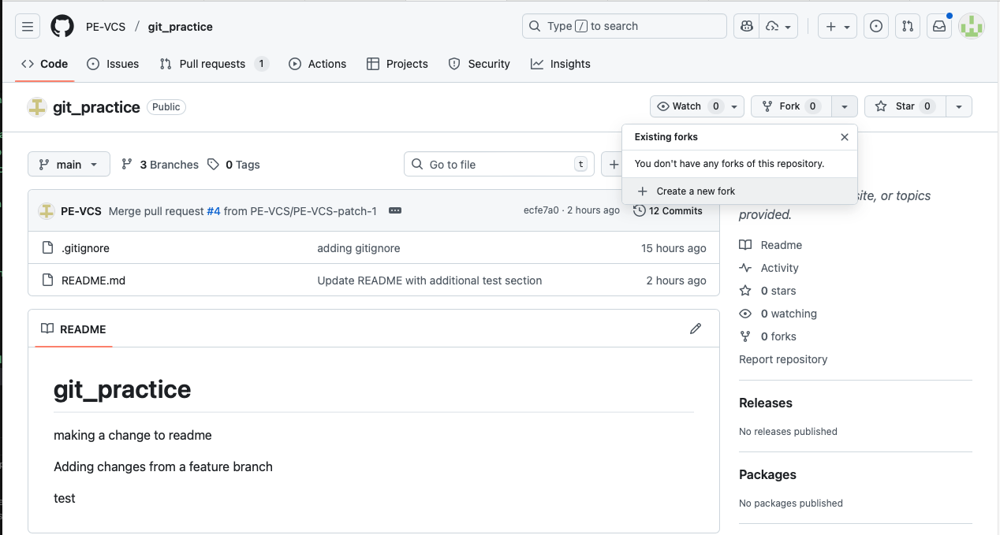

# Lab 3.2: Working with Forks

## Introduction

Forks are GitHub's way of letting you contribute to repositories you don't own or have write access to. When you fork a repository, you create your own copy that you can freely modify. This is how open-source collaboration works!

**By the end of this lab, you will:**
- Understand the difference between forks and clones
- Fork a repository on GitHub
- Make changes to your fork
- Create a pull request to the original repository
- Understand the fork workflow for open-source contribution

**Estimated Time:** 20 minutes

---

## Part 1: Understanding Forks vs. Collaborators

### What's the Difference?

In Lab 2.4, you worked as **collaborators** - you had direct write access to each other's repositories.

**Forks are different:**

**Collaborator Workflow** (Lab 2.4):
- Owner adds you as a collaborator
- You clone their repository
- You can push directly to their repository
- Used for **team projects** where everyone is trusted

**Fork Workflow** (This lab):
- You create your own copy (fork) on GitHub
- You don't need permission from the owner
- You can't push to the original repository
- You contribute via pull requests
- Used for **open-source projects** where maintainers control what gets merged

### When to Use Forks

✅ **Use forks when:**
- Contributing to open-source projects
- You don't have write access to a repository
- Experimenting with someone else's code
- Creating your own version of a project

❌ **Don't need forks when:**
- You're a collaborator on the repository
- You own the repository
- Working on a private team project

---

## Part 2: Forking a Repository

Let's fork your partner's repository from Lab 2.4 (or any public repository).

### Find a Repository to Fork

1. Go to your partner's `git_practice` repository on GitHub
   - Or use any public repository you find interesting
   - URL format: `https://github.com/[username]/git_practice`

2. Click the **Fork** button (top right, next to Star)



3. You'll see "Create a new fork" page

4. Notice:
   - **Owner**: Should be set to YOUR username
   - **Repository name**: Defaults to same name (`git_practice`)
   - **Description**: Copied from original
   - **Copy the main branch only**: ✅ Usually check this

5. Click **Create fork**

### What Just Happened?

GitHub creates a **complete copy** of the repository under your account:
- You now have `[your-username]/git_practice`
- The original is still `[partner-username]/git_practice`
- Your fork is **linked** to the original (shows "forked from...")
- You have **full control** over your fork


---

## Part 3: Making Changes to Your Fork

Now let's modify your fork.

### Clone Your Fork

1. On **your fork** (not the original), click the green **Code** button

2. Copy the URL

3. Open Git Bash or VS Code terminal

4. Clone **your fork**:
   ```bash
   cd ~/Documents/GitHub
   git clone https://github.com/[YOUR-username]/git_practice.git git_practice-fork
   cd git_practice-fork
   ```

   > **Note:** We're cloning into `git_practice-fork` to avoid conflicts with your existing `git_practice` folder

### Make a Change

5. Open the folder in VS Code or your text editor

6. Create a new file called `fork-contribution.md`

7. Add content:
   ```markdown
   # My Fork Contribution
   
   This file was added via a fork!
   
   ## What I learned about forks
   - Forks create a personal copy of a repository
   - I can make changes without affecting the original
   - Pull requests let me contribute back
   
   **Contributed by:** [Your Name]
   ```

8. Save the file

### Commit and Push to Your Fork

9. Stage and commit your change:
   ```bash
   git add fork-contribution.md
   git commit -m "Add fork contribution file"
   ```

10. Push to **your fork**:
    ```bash
    git push origin main
    ```

11. Go to **your fork** on GitHub - you should see the new file

---

## Part 4: Creating a Pull Request to the Original Repository

Now let's contribute your change back to the original repository.

### Open a Pull Request

1. On **your fork's page** on GitHub, you'll see a message:
   - "This branch is 1 commit ahead of [original-username]:main"
   - Click **Contribute** → **Open pull request**

2. You'll be taken to the **original repository** to create a PR

![Pull Request from Fork - Compare Across Forks]

3. Verify the direction:
   - **base repository**: `[partner-username]/git_practice` (original)
   - **base**: `main`
   - **head repository**: `[your-username]/git_practice` (your fork)
   - **compare**: `main`

4. This means: "Merge changes from MY fork into the ORIGINAL repository"

5. Click **Create pull request**

6. Add a title:
   ```
   Add fork contribution from [Your Name]
   ```

7. Add a description:
   ```
   Hi! I forked your repository and added a contribution file.
   
   This is practice for the fork workflow in Lab 3.1.
   ```

8. Click **Create pull request**

### What's Different from Lab 2.4?

- In Lab 2.4, you created PRs **within** the same repository (from a branch)
- Now you're creating a PR **from your fork** to the original repository
- The owner has to review and merge (you can't merge it yourself)

---

## Part 5: Reviewing and Merging a Fork PR (Partner Activity)

Now switch roles! Your partner should have created a fork of your repository and sent you a PR.

### Partner: Review the Fork PR

1. Go to **your** `git_practice` repository

2. Click the **Pull requests** tab

3. You should see a PR from your partner's **fork**

4. Notice it shows:
   - "wants to merge 1 commit into [your-username]:main from [partner-username]:main"
   - This is a cross-repository PR!

5. Click on the PR

6. Review the changes in the **Files changed** tab

7. Add a review comment if you like:
   ```
   Thanks for contributing via fork! Great work.
   ```

8. Click **Review changes** → **Approve** → **Submit review**

9. Click **Merge pull request** → **Confirm merge**

10. The contribution from your partner's fork is now in **your** repository!

---

## Part 6: Keeping Your Fork Up to Date

After the original repository receives new changes, your fork becomes outdated.

### Understanding Upstream

- **Origin**: Your fork (where you push)
- **Upstream**: The original repository (where you forked from)

### Sync Your Fork (Web Method)

1. Go to **your fork** on GitHub

2. You'll see a message if it's behind:
   - "This branch is X commits behind [original-username]:main"

3. Click **Sync fork** → **Update branch**

4. Your fork is now up to date!

### Sync Your Fork (Command Line Method)

Alternatively, you can sync from the command line:

1. Add the original repository as "upstream":
   ```bash
   git remote add upstream https://github.com/[partner-username]/git_practice.git
   ```

2. Fetch changes from upstream:
   ```bash
   git fetch upstream
   ```

3. Merge upstream changes into your main:
   ```bash
   git checkout main
   git merge upstream/main
   ```

4. Push to your fork:
   ```bash
   git push origin main
   ```

---

## Part 7: Fork Workflow Summary

Here's the complete fork contribution workflow:

### Contributing to a Project

1. **Fork** the repository on GitHub
2. **Clone** your fork to your computer
3. **Create a branch** for your changes (optional but recommended)
4. **Make changes** and commit
5. **Push** to your fork
6. **Create a Pull Request** from your fork to the original
7. **Discuss** with maintainers in the PR
8. **Update** your PR if requested
9. **Wait** for the maintainer to merge

### Maintaining Your Fork

1. **Sync regularly** to get updates from the original
2. **Resolve conflicts** if your changes conflict with upstream
3. **Delete branches** after PRs are merged
4. **Keep your fork updated** before starting new work

---

## Part 8: Real-World Fork Scenarios

### Scenario 1: Contributing to Open Source

You find a bug in an open-source project:

1. Fork the project
2. Fix the bug in your fork
3. Create a PR with your fix
4. Maintainers review and merge
5. Your contribution is now part of the project!

### Scenario 2: Creating Your Own Version

You want to customize a project for your needs:

1. Fork the project
2. Make your customizations
3. Use your fork (no PR needed)
4. Optionally: Sync updates from original when they improve it

### Scenario 3: Proposing a Feature

You have an idea for a new feature:

1. Fork the project
2. Implement the feature
3. Create a PR with detailed explanation
4. Discuss with maintainers
5. They might accept, reject, or request changes

---

## Cleanup

**Keep your fork!** It's your own copy to experiment with.

**Optional cleanup:**
- Delete the local clone if you don't need it:
  ```bash
  cd ~/Documents/GitHub
  rm -rf git_practice-fork
  ```

- Keep the fork on GitHub for future practice

---

## Conclusion

Congratulations! You've learned the fork workflow. You learned:

- **Forks vs. Collaborators**: When to use each approach
- **Forking**: Creating your own copy of a repository
- **Contributing**: Making changes and creating cross-repository PRs
- **Syncing**: Keeping your fork up to date with the original
- **Real-world scenarios**: How forks enable open-source collaboration

**Key Takeaways:**

1. **Forks give you freedom**: Experiment without affecting the original

2. **Pull requests connect forks**: Your changes can be contributed back

3. **No permission needed**: Fork any public repository

4. **Stay in sync**: Keep your fork updated from upstream

5. **Open source thrives on forks**: Most contributions use this workflow

## Next Steps

- Find an open-source project and fork it
- Read the project's CONTRIBUTING.md file
- Look for "good first issue" labels
- Make a real contribution to an open-source project!
- Keep your forks organized and up to date

## Reflection Questions

1. How is forking different from cloning?
2. Why do open-source projects use forks instead of collaborators?
3. What happens to your fork if the original repository is deleted?
4. When would you fork vs. when would you request collaborator access?
5. How does the fork workflow protect the original project?

**Well done on mastering the fork workflow!**
